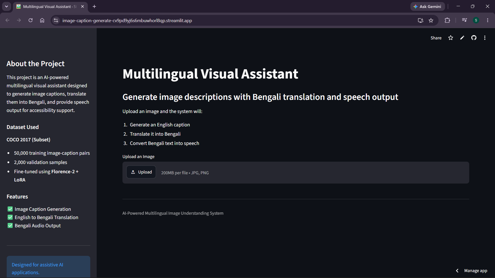
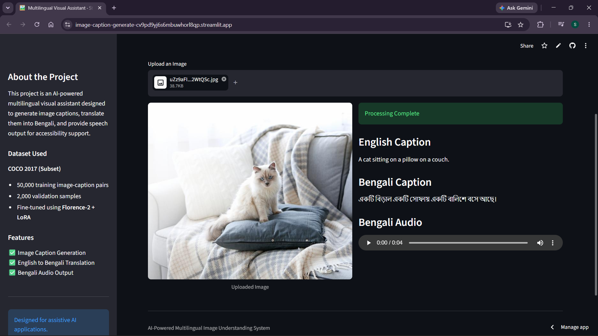
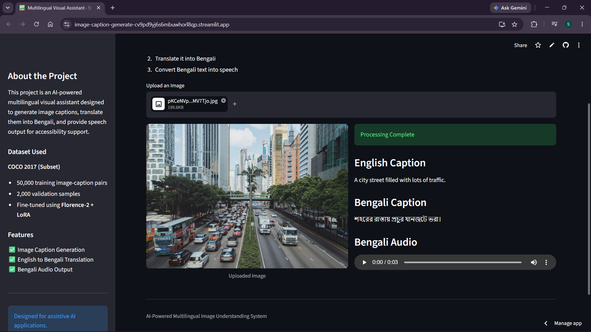
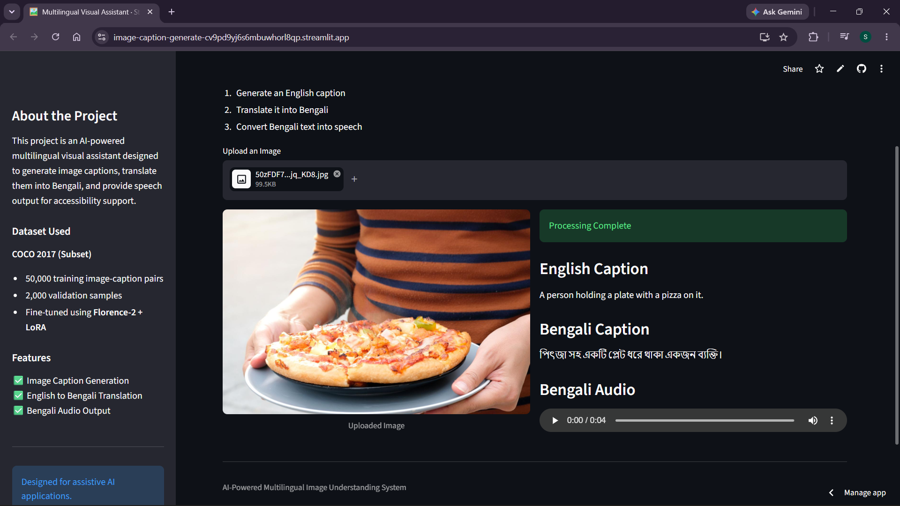

# 🖼️ Multilingual AI Accessibility Assistant

An AI-powered multilingual visual assistant that generates image captions, translates them into Bengali, and converts them into speech for accessibility support.

This project fine-tunes **Florence-2** using **LoRA** on a subset of the **COCO 2017 dataset** and builds an end-to-end pipeline for **visual understanding → translation → speech synthesis**.

---

## 🚀 Live Demo

**Streamlit App:**
https://image-caption-generate-cv9pd9yj6s6mbuwhorl8qp.streamlit.app/

---

## 📌 Features

- 🖼️ Image Caption Generation using Fine-tuned Florence-2
- 🌐 English to Bengali Translation
- 🔊 Bengali Text-to-Speech Output
- ⚡ Lightweight deployment with cloud model loading
- ♿ Accessibility-focused AI pipeline

---

## 🧠 Model Pipeline

Image Input
↓
Fine-Tuned Florence-2 (LoRA)
↓
English Caption Generation
↓
Bengali Translation
↓
Bengali Speech Output

---

## 📂 Dataset Used

### COCO 2017 Dataset (Subset)

- Original Dataset:
  - 118,287 training images
  - 591,753 captions

- Fine-tuned on:
  - **50,000 training image-caption pairs**

- Evaluated on:
  - **2,000 validation samples**

This dataset provides diverse real-world object and scene descriptions for robust caption generation.

---

## 🏗️ Project Structure

```bash
image-caption-generate/
│── assets/
│   ├── homepage.png
│   ├── demo_cat.png
│   ├── demo_pizza.png
│   ├── demo_traffic.png
│
│── models/
│   ├── final_model_epoch_3/
│
│── outputs/
│   ├── audio/
│   ├── temp/
│
│── src/
│   ├── caption.py
│   ├── translate.py
│   ├── tts.py
│   ├── pipeline.py
│
│── app.py
│── requirements.txt
│── README.md
```

---

## 📸 Application Preview

### Homepage



### Cat Caption Example



### Traffic Scene Example



### Food Recognition Example

## 

## 🛠️ Tech Stack

- Python
- PyTorch
- Transformers
- Florence-2
- PEFT (LoRA)
- Streamlit
- gTTS
- Deep Translator
- Pillow

---

## 📊 Fine-Tuning Results

Evaluation on 200 validation samples:

- **BLEU:** 0.1308
- **METEOR:** 0.3826
- **ROUGE-1:** 0.4425
- **ROUGE-2:** 0.1850
- **ROUGE-L:** 0.4024

These results demonstrate effective caption generation and improved semantic understanding after LoRA fine-tuning.

---

## 🎯 Use Cases

- Assistive technology for visually impaired users
- Multilingual visual understanding
- Image-to-speech applications
- Smart accessibility systems

---

## 🔮 Future Improvements

- Support for multiple Indian languages
- Real-time camera input
- OCR integration
- Scene-level reasoning
- FastAPI deployment

---

## 👨‍💻 Author

**Sayan Ghorai**
M.Tech in AI & DS
Artificial Intelligence | Machine Learning | Computer Vision | NLP
